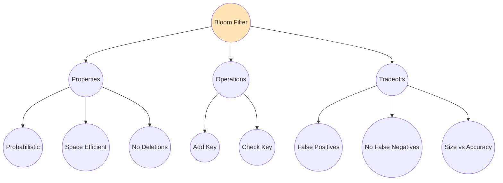
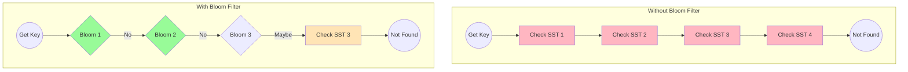
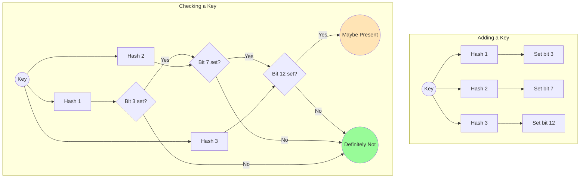
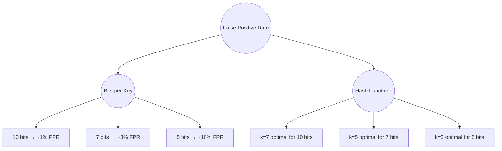
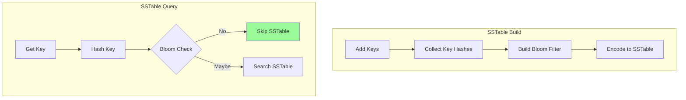
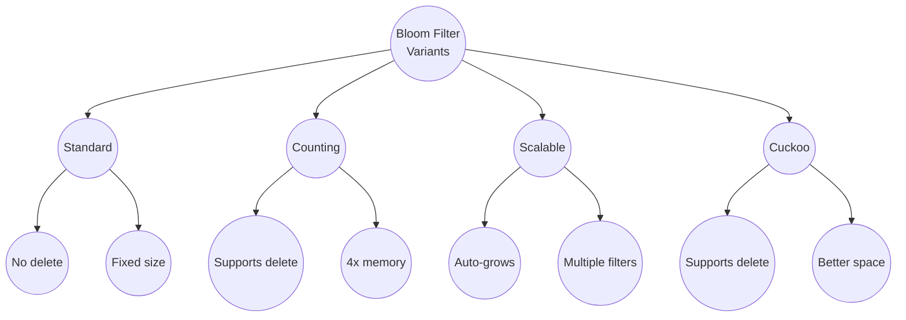

# Bloom Filter

A Bloom filter is a **space-efficient probabilistic data structure** that answers "is this key possibly in this set?" - with a small chance of false positives but never false negatives.

## Overview



## Why Bloom Filters?

In an LSM tree, a point lookup might need to check many SSTables. Without bloom filters:



**Result**: 4 disk reads → 1 disk read (75% reduction)

## How It Works

A bloom filter is a bit array with multiple hash functions:



## Code Example

From mini-lsm's Bloom filter implementation:

```rust
pub struct Bloom {
    /// Bit array storing the filter
    pub(crate) filter: Bytes,
    /// Number of hash functions (k)
    pub(crate) k: u8,
}

impl Bloom {
    /// Calculate optimal bits per key for a given false positive rate
    pub fn bloom_bits_per_key(entries: usize, false_positive_rate: f64) -> usize {
        let size = -1.0 * (entries as f64) * false_positive_rate.ln()
            / std::f64::consts::LN_2.powi(2);
        let locs = (size / (entries as f64)).ceil();
        locs as usize
    }

    /// Build a bloom filter from key hashes
    pub fn build_from_key_hashes(keys: &[u32], bits_per_key: usize) -> Self {
        // Calculate optimal number of hash functions
        // k = bits_per_key * ln(2) ≈ bits_per_key * 0.69
        let k = (bits_per_key as f64 * 0.69) as u32;
        let k = k.clamp(1, 30);

        // Allocate bit array
        let nbits = (keys.len() * bits_per_key).max(64);
        let nbytes = (nbits + 7) / 8;
        let nbits = nbytes * 8;
        let mut filter = BytesMut::zeroed(nbytes);

        // Add each key
        for h in keys {
            let mut h = *h;
            let delta = h.rotate_left(15); // Secondary hash

            for _ in 0..k {
                let bit_pos = (h as usize) % nbits;
                filter.set_bit(bit_pos, true);
                h = h.wrapping_add(delta);
            }
        }

        Self {
            filter: filter.freeze(),
            k: k as u8,
        }
    }

    /// Check if a key may be in the filter
    pub fn may_contain(&self, mut h: u32) -> bool {
        let nbits = self.filter.bit_len();
        let delta = h.rotate_left(15);

        for _ in 0..self.k {
            let bit_pos = h % (nbits as u32);
            if !self.filter.get_bit(bit_pos as usize) {
                return false; // Definitely not present
            }
            h = h.wrapping_add(delta);
        }
        true // Possibly present
    }
}

/// Bit manipulation helpers
pub trait BitSlice {
    fn get_bit(&self, idx: usize) -> bool;
}

impl<T: AsRef<[u8]>> BitSlice for T {
    fn get_bit(&self, idx: usize) -> bool {
        let pos = idx / 8;
        let offset = idx % 8;
        (self.as_ref()[pos] & (1 << offset)) != 0
    }
}
```

## False Positive Rate

The false positive rate depends on:
- **m**: number of bits in filter
- **n**: number of keys added
- **k**: number of hash functions

```
FPR ≈ (1 - e^(-kn/m))^k
```



## Configuration Guide

| Bits per Key | False Positive Rate | Memory per 1M Keys |
|--------------|--------------------|--------------------|
| 5 | ~10% | 625 KB |
| 7 | ~3% | 875 KB |
| 10 | ~1% | 1.25 MB |
| 15 | ~0.1% | 1.875 MB |
| 20 | ~0.01% | 2.5 MB |

## Integration with SSTable



## Real-World Examples

### RocksDB

RocksDB's bloom filter options:
- **Full filter**: One filter for entire SSTable (default)
- **Partitioned filter**: Filter per data block (memory efficient)
- **Ribbon filter**: Newer, more space-efficient alternative
- **Prefix bloom**: Filter on key prefixes for prefix scans

### LevelDB

LevelDB uses a simple full-file bloom filter with configurable bits per key (default 10).

### Cassandra

Cassandra's bloom filters:
- Per-SSTable filters
- Configurable false positive rate per table
- Stored separately from data for faster loading
- Bloom filter statistics in system tables

### Redis

Redis uses bloom filters in the **RedisBloom module**:
- Scalable bloom filters (auto-grow)
- Counting bloom filters (support deletion)
- Cuckoo filters (alternative with deletion)

## Variants



## Use Cases

| Use Case | Config | Why |
|----------|--------|-----|
| **Point lookups** | 10 bits, ~1% FPR | Good balance |
| **Range scans** | Prefix bloom | Filter on prefix |
| **Memory constrained** | 5 bits, ~10% FPR | Smaller filters |
| **Hot data** | 15+ bits, ~0.1% FPR | Minimize disk reads |

## Key Takeaways

1. **Bloom filters eliminate disk reads** - most "not found" cases skip I/O entirely
2. **No false negatives** - if bloom says "no", key definitely doesn't exist
3. **10 bits per key ≈ 1% FPR** - the sweet spot for most workloads
4. **Memory efficient** - ~1.25 MB per million keys at 1% FPR
5. **Can't delete** - standard bloom filters don't support removal
