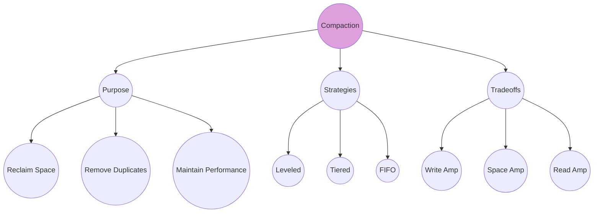
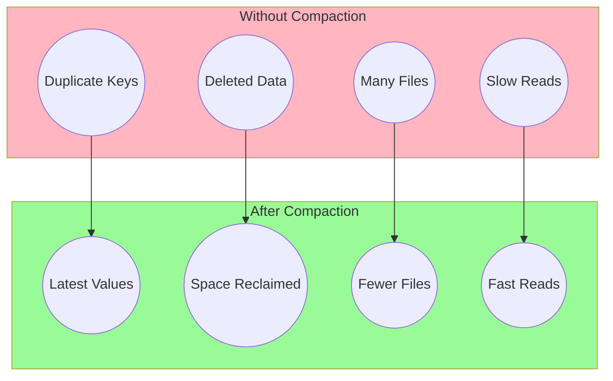
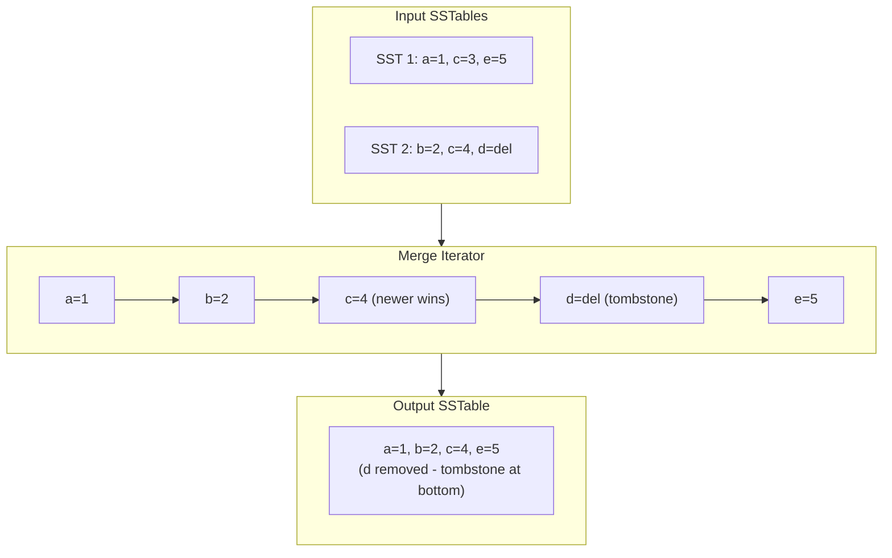
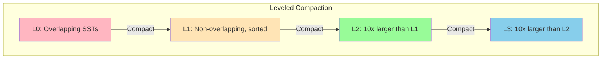
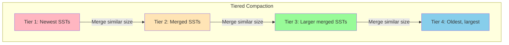
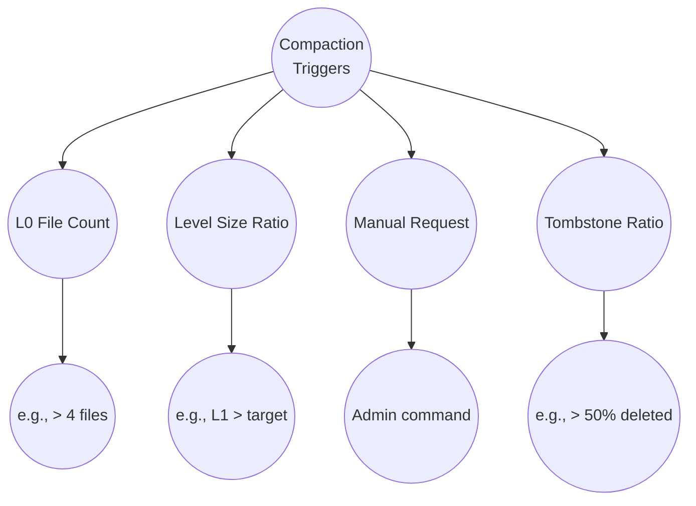

# Compaction

Compaction is the **background maintenance process** that merges SSTables to reclaim space, remove obsolete data, and maintain read performance.

## Overview



## Why Compaction?

Without compaction, the LSM tree accumulates problems:



## The Merge Process

Compaction performs a **merge sort** on multiple sorted SSTables:



## Compaction Strategies

### Leveled Compaction (RocksDB Default)



**Characteristics:**
- Each level (except L0) has non-overlapping SSTables
- Level N+1 is ~10x the size of level N
- Low space amplification (~10%)
- Higher write amplification

### Tiered Compaction (Universal)



**Characteristics:**
- SSTables grouped by size tiers
- Merge similarly-sized SSTables together
- Lower write amplification
- Higher space amplification (up to 2x)

### Comparison

| Aspect | Leveled | Tiered |
|--------|---------|--------|
| Write amplification | 10-30x | 4-10x |
| Space amplification | ~1.1x | ~2x |
| Read amplification | Low | Higher |
| Best for | Read-heavy | Write-heavy |

## Code Example

From mini-lsm's leveled compaction:

```rust
#[derive(Debug)]
pub struct LeveledCompactionTask {
    /// Source level (None = L0)
    pub upper_level: Option<usize>,
    /// SSTable IDs from source level
    pub upper_level_sst_ids: Vec<usize>,
    /// Target level
    pub lower_level: usize,
    /// Overlapping SSTable IDs from target level
    pub lower_level_sst_ids: Vec<usize>,
    /// Is target the bottom level?
    pub is_lower_level_bottom_level: bool,
}

pub struct LeveledCompactionController {
    options: LeveledCompactionOptions,
}

impl LeveledCompactionController {
    /// Generate a compaction task based on current state
    pub fn generate_compaction_task(
        &self,
        snapshot: &LsmStorageState,
    ) -> Option<LeveledCompactionTask> {
        // Priority 1: Flush L0 if too many files
        if snapshot.l0_sstables.len() >= self.options.level0_file_num_compaction_trigger {
            let base_level = self.compute_base_level(snapshot);
            return Some(LeveledCompactionTask {
                upper_level: None,
                upper_level_sst_ids: snapshot.l0_sstables.clone(),
                lower_level: base_level,
                lower_level_sst_ids: self.find_overlapping_ssts(
                    snapshot,
                    &snapshot.l0_sstables,
                    base_level,
                ),
                is_lower_level_bottom_level: base_level == self.options.max_levels,
            });
        }

        // Priority 2: Compact level exceeding size target
        for level in 1..self.options.max_levels {
            let current_size = self.level_size(snapshot, level);
            let target_size = self.target_level_size(level);

            if current_size > target_size {
                let sst_to_compact = self.pick_sst_to_compact(snapshot, level);
                return Some(LeveledCompactionTask {
                    upper_level: Some(level),
                    upper_level_sst_ids: vec![sst_to_compact],
                    lower_level: level + 1,
                    lower_level_sst_ids: self.find_overlapping_ssts(
                        snapshot,
                        &[sst_to_compact],
                        level + 1,
                    ),
                    is_lower_level_bottom_level: level + 1 == self.options.max_levels,
                });
            }
        }
        None
    }

    /// Find SSTables in target level that overlap with source keys
    fn find_overlapping_ssts(
        &self,
        snapshot: &LsmStorageState,
        sst_ids: &[usize],
        in_level: usize,
    ) -> Vec<usize> {
        // Find key range of source SSTables
        let begin_key = sst_ids.iter()
            .map(|id| snapshot.sstables[id].first_key())
            .min().unwrap();
        let end_key = sst_ids.iter()
            .map(|id| snapshot.sstables[id].last_key())
            .max().unwrap();

        // Find all overlapping SSTables in target level
        snapshot.levels[in_level - 1].1.iter()
            .filter(|&sst_id| {
                let sst = &snapshot.sstables[sst_id];
                !(sst.last_key() < begin_key || sst.first_key() > end_key)
            })
            .copied()
            .collect()
    }
}
```

## Compaction Execution

```rust
impl LsmStorageInner {
    /// Execute a compaction task
    fn compact(&self, task: &CompactionTask) -> Result<Vec<Arc<SsTable>>> {
        let snapshot = self.state.read().clone();

        // Create merge iterator over input SSTables
        let iter = match task {
            CompactionTask::Leveled(task) => {
                let upper_iter = self.create_iterator(&task.upper_level_sst_ids);
                let lower_iter = self.create_concat_iterator(&task.lower_level_sst_ids);
                TwoMergeIterator::create(upper_iter, lower_iter)?
            }
            // ... other strategies
        };

        // Generate output SSTables
        self.compact_generate_sst_from_iter(iter, task.compact_to_bottom_level())
    }

    /// Build output SSTables from merge iterator
    fn compact_generate_sst_from_iter(
        &self,
        mut iter: impl StorageIterator,
        compact_to_bottom_level: bool,
    ) -> Result<Vec<Arc<SsTable>>> {
        let mut builder = None;
        let mut new_ssts = Vec::new();

        while iter.is_valid() {
            if builder.is_none() {
                builder = Some(SsTableBuilder::new(self.options.block_size));
            }

            let b = builder.as_mut().unwrap();

            // Skip tombstones at bottom level (finally remove deleted keys)
            if compact_to_bottom_level && iter.value().is_empty() {
                iter.next()?;
                continue;
            }

            b.add(iter.key(), iter.value());
            iter.next()?;

            // Split into multiple SSTables if needed
            if b.estimated_size() >= self.options.target_sst_size {
                let sst = self.finish_sst(builder.take().unwrap())?;
                new_ssts.push(sst);
            }
        }

        // Finish last SSTable
        if let Some(b) = builder {
            new_ssts.push(self.finish_sst(b)?);
        }

        Ok(new_ssts)
    }
}
```

## Amplification Factors

```mermaid
graph TB
    AMP((Amplification))

    AMP --> WRITE((Write Amp))
    AMP --> SPACE((Space Amp))
    AMP --> READ((Read Amp))

    WRITE --> W1((Data rewritten<br/>multiple times))
    WRITE --> W2((Leveled: 10-30x))
    WRITE --> W3((Tiered: 4-10x))

    SPACE --> S1((Temporary duplicate<br/>data on disk))
    SPACE --> S2((Leveled: ~1.1x))
    SPACE --> S3((Tiered: ~2x))

    READ --> R1((Files checked<br/>per query))
    READ --> R2((Leveled: O(log N)))
    READ --> R3((Tiered: O(N)))
```

## Real-World Examples

### RocksDB

RocksDB's compaction features:
- **Leveled compaction** with dynamic level sizes
- **Universal compaction** (tiered) for write-heavy workloads
- **FIFO compaction** for time-series data
- **Subcompactions** for parallel compaction within a task
- **Compaction filters** to transform or delete data during compaction

### Cassandra

Cassandra offers multiple strategies:
- **SizeTieredCompactionStrategy (STCS)**: Good for write-heavy
- **LeveledCompactionStrategy (LCS)**: Good for read-heavy
- **TimeWindowCompactionStrategy (TWCS)**: For time-series data
- **UnifiedCompactionStrategy (UCS)**: Newer adaptive strategy

### ScyllaDB

ScyllaDB's compaction:
- **Incremental compaction**: Reduces space amplification
- **Per-shard compaction**: Parallelizes across CPU cores
- **Compaction groups**: Better resource management

## Configuration Guide

| Workload | Strategy | Config |
|----------|----------|--------|
| **Read-heavy** | Leveled | Default multiplier (10x) |
| **Write-heavy** | Tiered | 4 tiers, size ratio 4 |
| **Time-series** | FIFO/TWCS | TTL-based deletion |
| **Mixed** | Leveled | Larger L0 trigger |

## Compaction Triggers



## Key Takeaways

1. **Compaction is essential** - without it, reads slow down and space is wasted
2. **Strategy choice matters** - leveled for reads, tiered for writes
3. **Background process** - runs continuously without blocking foreground ops
4. **Tombstones need special handling** - only removed at bottom level
5. **Amplification is the cost** - tradeoff between write, space, and read amp
