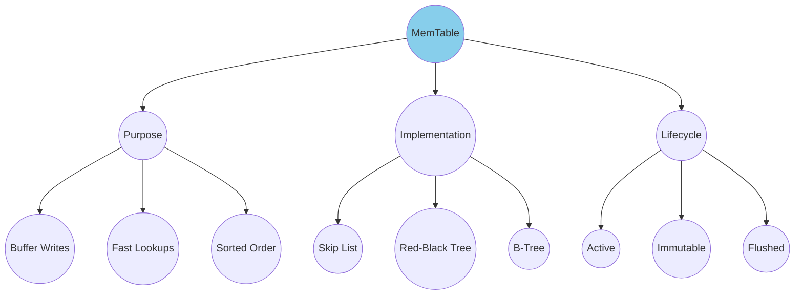
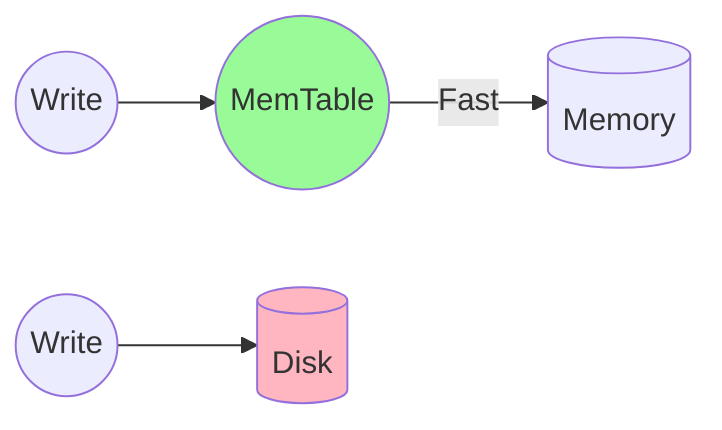
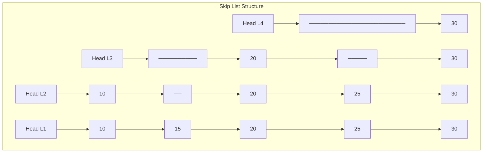
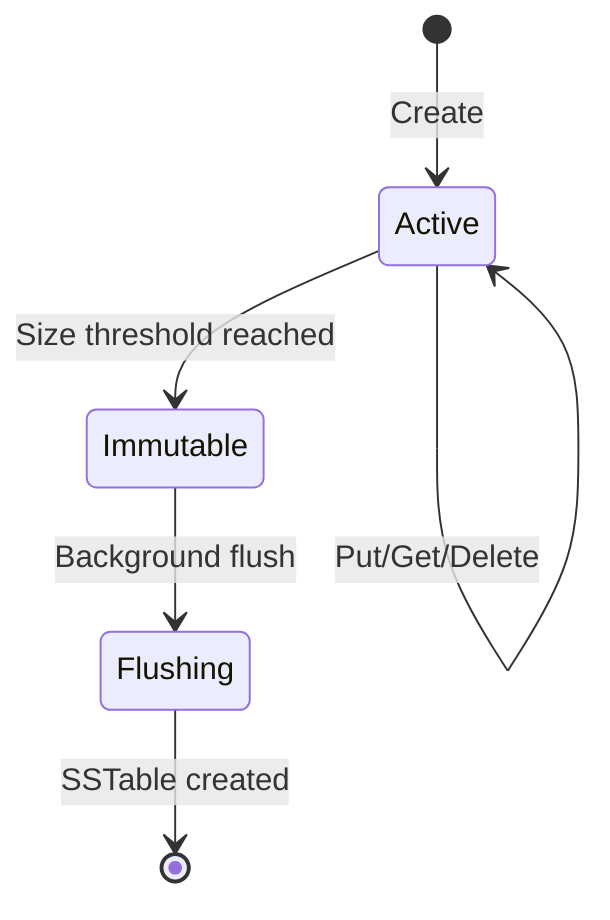

# MemTable

The MemTable is the **write buffer** of an LSM tree - an in-memory data structure that absorbs all incoming writes before they're persisted to disk.

## Overview



## Why MemTable?

Writing directly to disk for every operation would be prohibitively slow. The MemTable solves this by:

1. **Batching writes in memory** - amortizes disk I/O cost
2. **Maintaining sorted order** - enables efficient range scans and sequential flush
3. **Serving recent reads** - newest data is fastest to access



## Data Structure: Skip List

Most LSM implementations use a **skip list** for the MemTable because it offers:

- **O(log n)** insert, lookup, and delete
- **Lock-free concurrent access** (with careful implementation)
- **Natural sorted iteration** for flushing



## Code Example

From mini-lsm's implementation using `crossbeam-skiplist`:

```rust
use crossbeam_skiplist::SkipMap;
use bytes::Bytes;

pub struct MemTable {
    /// Concurrent skip list for key-value storage
    map: Arc<SkipMap<Bytes, Bytes>>,
    /// Optional write-ahead log for durability
    wal: Option<Wal>,
    /// Unique identifier for this MemTable
    id: usize,
    /// Track approximate size for flush decisions
    approximate_size: Arc<AtomicUsize>,
}

impl MemTable {
    /// Create a new empty MemTable
    pub fn create(id: usize) -> Self {
        Self {
            id,
            map: Arc::new(SkipMap::new()),
            wal: None,
            approximate_size: Arc::new(AtomicUsize::new(0)),
        }
    }

    /// Get a value by key - O(log n)
    pub fn get(&self, key: &[u8]) -> Option<Bytes> {
        self.map.get(key).map(|e| e.value().clone())
    }

    /// Put a key-value pair - O(log n)
    pub fn put(&self, key: &[u8], value: &[u8]) -> Result<()> {
        let estimated_size = key.len() + value.len();
        self.map.insert(
            Bytes::copy_from_slice(key),
            Bytes::copy_from_slice(value)
        );
        self.approximate_size
            .fetch_add(estimated_size, Ordering::Relaxed);
        // Also write to WAL if enabled
        if let Some(ref wal) = self.wal {
            wal.put(key, value)?;
        }
        Ok(())
    }

    /// Flush MemTable contents to an SSTable
    pub fn flush(&self, builder: &mut SsTableBuilder) -> Result<()> {
        // Iterate in sorted order (skip list property)
        for entry in self.map.iter() {
            builder.add(
                KeySlice::from_slice(&entry.key()[..]),
                &entry.value()[..]
            );
        }
        Ok(())
    }
}
```

## MemTable Lifecycle



### State Transitions

| State | Writes | Reads | Description |
|-------|--------|-------|-------------|
| **Active** | Yes | Yes | Current write buffer |
| **Immutable** | No | Yes | Frozen, awaiting flush |
| **Flushing** | No | Yes | Being written to disk |

## Size Management

The MemTable size is bounded to control memory usage:

```rust
// Check if MemTable should be frozen
if memtable.approximate_size() >= options.target_memtable_size {
    // Freeze current MemTable
    let frozen = std::mem::replace(
        &mut state.memtable,
        Arc::new(MemTable::create(next_id))
    );
    // Add to immutable list
    state.imm_memtables.insert(0, frozen);
}
```

**Typical sizes:**
- Default: 4-64 MB
- Write-heavy: 128-256 MB
- Memory-constrained: 1-4 MB

## Real-World Examples

### RocksDB

RocksDB uses a **concurrent skip list** MemTable by default, with options for:
- `VectorRep`: Vector-based, good for bulk loading
- `HashSkipListRep`: Hash index + skip list for prefix lookups
- `HashLinkListRep`: Hash index + linked list

### LevelDB

LevelDB uses a simpler **arena-allocated skip list** that's single-threaded but very memory-efficient.

### Cassandra

Cassandra's MemTable is a **ConcurrentSkipListMap** partitioned by partition key, allowing parallel flushes per partition.

## Use Cases

| Use Case | MemTable Config | Why |
|----------|-----------------|-----|
| **High write throughput** | Large (128MB+) | Fewer flushes, more batching |
| **Low memory** | Small (4MB) | Frequent flushes, less RAM |
| **Point lookups** | Hash-based | O(1) lookup for exact keys |
| **Range scans** | Skip list | Natural sorted iteration |

## Key Takeaways

1. **MemTable is the write buffer** - all writes go here first
2. **Skip lists are the default** - O(log n) ops with sorted iteration
3. **Size triggers flush** - when full, freeze and flush to SSTable
4. **Immutability enables concurrency** - frozen MemTables are read-only
5. **WAL provides durability** - MemTable alone is volatile
