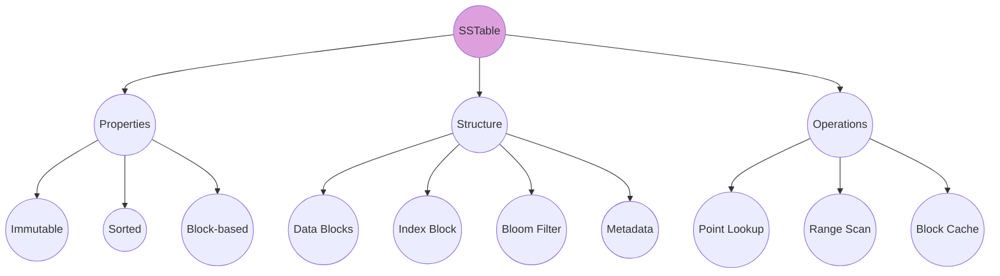
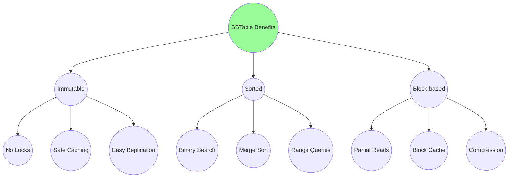
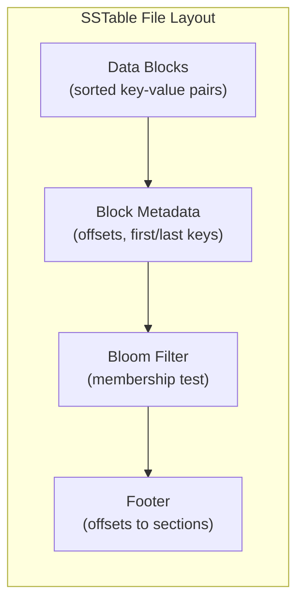
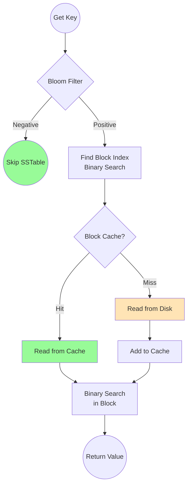
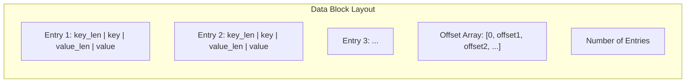

# SSTable

The SSTable (Sorted String Table) is the **persistent storage format** of an LSM tree - an immutable, sorted file on disk containing key-value pairs organized into blocks.

## Overview



## Why SSTable?

SSTables provide several critical properties:

1. **Immutability** - once written, never modified (simplifies concurrency)
2. **Sorted order** - enables binary search and efficient merging
3. **Block-based** - allows partial reads and caching
4. **Compression-friendly** - sorted data compresses well



## File Format



### Detailed Layout

| Section | Contents | Purpose |
|---------|----------|---------|
| **Data Blocks** | Sorted KV pairs + checksums | Actual data storage |
| **Block Metadata** | Offset, first_key, last_key per block | Index for binary search |
| **Bloom Filter** | Bit array + hash count | Skip non-existent keys |
| **Footer** | Offsets to metadata and bloom | Entry point for reading |

## Code Example

From mini-lsm's SSTable implementation:

```rust
/// Block metadata for indexing
pub struct BlockMeta {
    /// Offset of this data block in the file
    pub offset: usize,
    /// The first key of the data block
    pub first_key: KeyBytes,
    /// The last key of the data block
    pub last_key: KeyBytes,
}

/// An SSTable stored on disk
pub struct SsTable {
    /// The actual file on disk
    file: FileObject,
    /// Metadata for each data block
    block_meta: Vec<BlockMeta>,
    /// Offset where metadata section starts
    block_meta_offset: usize,
    /// Unique SSTable ID
    id: usize,
    /// Optional block cache (shared across SSTables)
    block_cache: Option<Arc<BlockCache>>,
    /// First key in the entire SSTable
    first_key: KeyBytes,
    /// Last key in the entire SSTable
    last_key: KeyBytes,
    /// Bloom filter for membership queries
    bloom: Option<Bloom>,
}

impl SsTable {
    /// Find the block that may contain a key using binary search
    pub fn find_block_idx(&self, key: KeySlice) -> usize {
        self.block_meta
            .partition_point(|meta| meta.first_key.as_key_slice() <= key)
            .saturating_sub(1)
    }

    /// Read a block from disk
    pub fn read_block(&self, block_idx: usize) -> Result<Arc<Block>> {
        let offset = self.block_meta[block_idx].offset;
        let offset_end = self.block_meta
            .get(block_idx + 1)
            .map_or(self.block_meta_offset, |x| x.offset);

        let block_data = self.file.read(offset as u64, (offset_end - offset) as u64)?;

        // Verify checksum
        let checksum = (&block_data[block_len..]).get_u32();
        if checksum != crc32fast::hash(&block_data[..block_len]) {
            bail!("block checksum mismatched");
        }

        Ok(Arc::new(Block::decode(&block_data[..block_len])))
    }

    /// Read with block cache (avoids repeated disk reads)
    pub fn read_block_cached(&self, block_idx: usize) -> Result<Arc<Block>> {
        if let Some(ref cache) = self.block_cache {
            cache.try_get_with((self.id, block_idx), || self.read_block(block_idx))
                .map_err(|e| anyhow!("{}", e))
        } else {
            self.read_block(block_idx)
        }
    }
}
```

## Building an SSTable

```rust
pub struct SsTableBuilder {
    builder: BlockBuilder,
    first_key: Vec<u8>,
    last_key: Vec<u8>,
    data: Vec<u8>,
    pub(crate) meta: Vec<BlockMeta>,
    block_size: usize,
    key_hashes: Vec<u32>,
}

impl SsTableBuilder {
    /// Add a key-value pair to the SSTable
    pub fn add(&mut self, key: KeySlice, value: &[u8]) {
        // Track first key
        if self.first_key.is_empty() {
            self.first_key = key.raw_ref().to_vec();
        }
        // Collect key hash for bloom filter
        self.key_hashes.push(farmhash::fingerprint32(key.raw_ref()));

        // Add to current block
        if !self.builder.add(key, value) {
            // Block is full, finish it and start new one
            self.finish_block();
            assert!(self.builder.add(key, value));
            self.first_key = key.raw_ref().to_vec();
        }
        self.last_key = key.raw_ref().to_vec();
    }

    /// Build the final SSTable file
    pub fn build(self, id: usize, path: impl AsRef<Path>) -> Result<SsTable> {
        // 1. Write remaining data block
        // 2. Encode and write block metadata
        // 3. Build and write bloom filter
        // 4. Write footer with offsets
        // ...
    }
}
```

## Read Path



## Block Structure

Each data block contains sorted key-value pairs:



## Real-World Examples

### RocksDB

RocksDB's SSTable format includes:
- **Data blocks** with prefix compression
- **Filter blocks** (bloom filters per block or per SSTable)
- **Index blocks** (partitioned for large SSTables)
- **Compression dictionary** for better ratios
- **Properties block** for statistics

### LevelDB

LevelDB's simpler format:
- Data blocks with restart points for prefix compression
- Single bloom filter per SSTable
- Two-level index (index of index blocks)

### Apache Cassandra

Cassandra's SSTable includes:
- **Partition index** for partition key lookups
- **Row index** for clustering column lookups
- **Compression info** for random access to compressed blocks
- **Statistics** for query optimization

## Performance Characteristics

| Operation | Complexity | Notes |
|-----------|------------|-------|
| Point lookup | O(log B + log K) | B = blocks, K = keys per block |
| Range scan | O(log B + N) | N = keys in range |
| Build | O(N) | Sequential write |
| Merge | O(N + M) | N, M = sizes of input SSTables |

## Use Cases

| Use Case | SSTable Config | Why |
|----------|----------------|-----|
| **Large values** | Large blocks (64KB+) | Fewer index entries |
| **Point lookups** | Small blocks (4KB) + bloom | Fast seeks |
| **Compression** | Medium blocks (16KB) | Good ratio vs overhead |
| **Range scans** | Large blocks + no bloom | Sequential read efficiency |

## Key Takeaways

1. **Immutable by design** - simplifies everything from caching to replication
2. **Block-based for efficiency** - partial reads, caching, compression
3. **Sorted for searching** - binary search at file and block level
4. **Bloom filters are essential** - skip SSTables that don't have the key
5. **Block cache is critical** - avoid repeated disk reads for hot data
