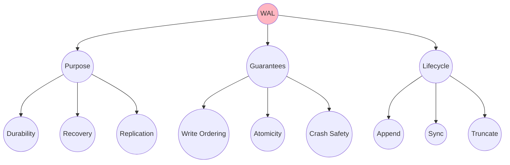
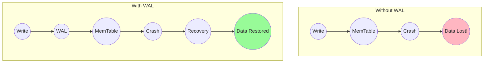
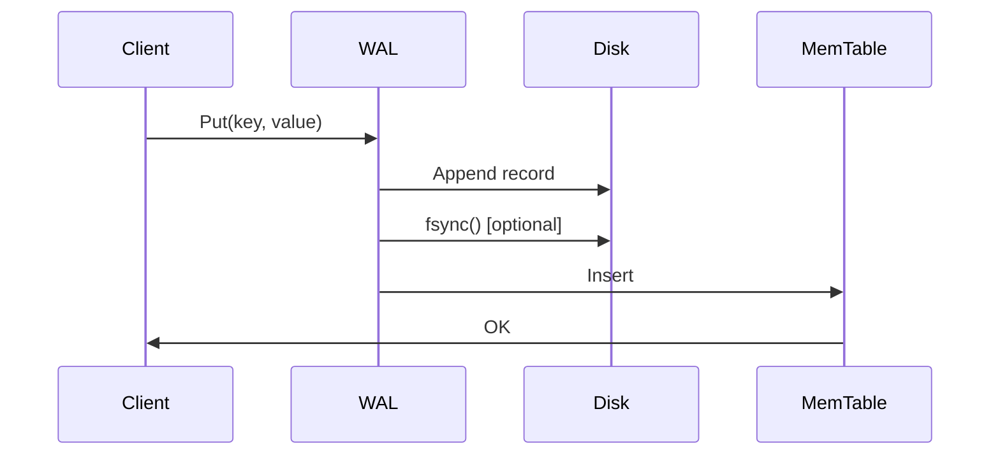
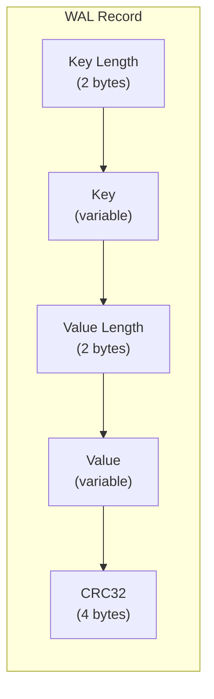
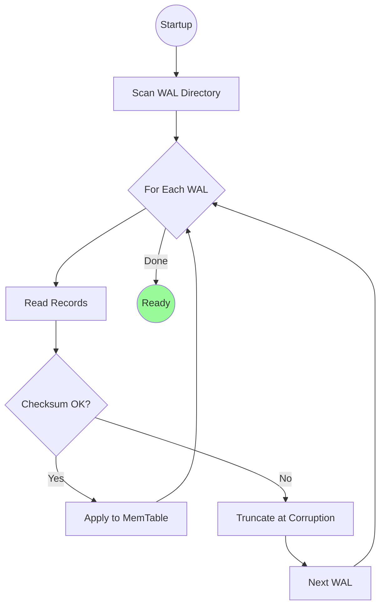
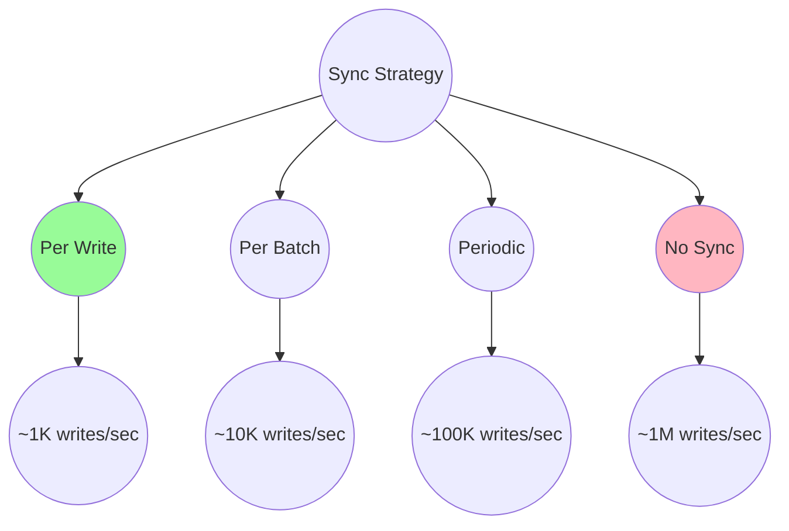
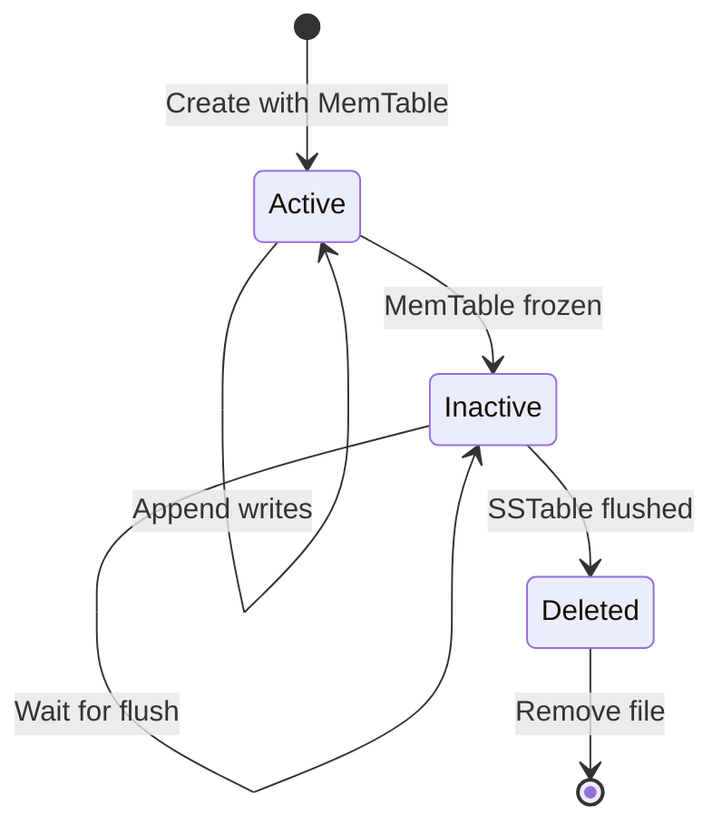

# Write-Ahead Log (WAL)

The Write-Ahead Log (WAL) provides **durability** for an LSM tree - ensuring that acknowledged writes survive crashes even before they're flushed to SSTables.

## Overview



## Why WAL?

The MemTable is volatile - if the system crashes, all buffered writes are lost. The WAL solves this:



## Write Protocol

Every write follows this sequence:

1. **Append to WAL** - sequential write to disk
2. **Sync WAL** - ensure data is durable (optional per-write)
3. **Update MemTable** - apply to in-memory structure
4. **Acknowledge** - confirm to client



## Record Format

Each WAL record is self-contained for recovery:



## Code Example

From mini-lsm's WAL implementation:

```rust
use std::fs::{File, OpenOptions};
use std::io::{BufWriter, Write};
use parking_lot::Mutex;

pub struct Wal {
    /// Buffered writer for efficient appends
    file: Arc<Mutex<BufWriter<File>>>,
}

impl Wal {
    /// Create a new WAL file
    pub fn create(path: impl AsRef<Path>) -> Result<Self> {
        Ok(Self {
            file: Arc::new(Mutex::new(BufWriter::new(
                OpenOptions::new()
                    .read(true)
                    .create_new(true)
                    .write(true)
                    .open(path)?
            ))),
        })
    }

    /// Append a key-value pair to the WAL
    pub fn put(&self, key: &[u8], value: &[u8]) -> Result<()> {
        let mut file = self.file.lock();
        let mut buf = Vec::with_capacity(key.len() + value.len() + 8);
        let mut hasher = crc32fast::Hasher::new();

        // Encode key
        hasher.write_u16(key.len() as u16);
        buf.put_u16(key.len() as u16);
        hasher.write(key);
        buf.put_slice(key);

        // Encode value
        hasher.write_u16(value.len() as u16);
        buf.put_u16(value.len() as u16);
        hasher.write(value);
        buf.put_slice(value);

        // Add checksum
        buf.put_u32(hasher.finalize());

        file.write_all(&buf)?;
        Ok(())
    }

    /// Sync WAL to disk (fsync)
    pub fn sync(&self) -> Result<()> {
        let mut file = self.file.lock();
        file.flush()?;
        file.get_mut().sync_all()?;
        Ok(())
    }

    /// Recover MemTable state from WAL
    pub fn recover(path: impl AsRef<Path>, skiplist: &SkipMap<Bytes, Bytes>) -> Result<Self> {
        let mut file = OpenOptions::new()
            .read(true)
            .append(true)
            .open(&path)?;

        let mut buf = Vec::new();
        file.read_to_end(&mut buf)?;
        let mut rbuf: &[u8] = buf.as_slice();

        // Replay each record
        while rbuf.has_remaining() {
            let mut hasher = crc32fast::Hasher::new();

            // Read key
            let key_len = rbuf.get_u16() as usize;
            hasher.write_u16(key_len as u16);
            let key = Bytes::copy_from_slice(&rbuf[..key_len]);
            hasher.write(&key);
            rbuf.advance(key_len);

            // Read value
            let value_len = rbuf.get_u16() as usize;
            hasher.write_u16(value_len as u16);
            let value = Bytes::copy_from_slice(&rbuf[..value_len]);
            hasher.write(&value);
            rbuf.advance(value_len);

            // Verify checksum
            let checksum = rbuf.get_u32();
            if hasher.finalize() != checksum {
                bail!("checksum mismatch - WAL corrupted");
            }

            // Apply to MemTable
            skiplist.insert(key, value);
        }

        Ok(Self {
            file: Arc::new(Mutex::new(BufWriter::new(file))),
        })
    }
}
```

## Recovery Process



## Sync Strategies

| Strategy | Durability | Performance | Use Case |
|----------|------------|-------------|----------|
| **Sync per write** | Highest | Slowest | Financial data |
| **Sync per batch** | High | Medium | General OLTP |
| **Periodic sync** | Medium | Fast | Analytics, logs |
| **No sync** | Lowest | Fastest | Caching, temp data |



## WAL Lifecycle



## Real-World Examples

### RocksDB

RocksDB's WAL features:
- **WAL recycling** - reuse old WAL files to avoid allocation
- **Manual WAL flush** - application-controlled durability
- **WAL compression** - reduce I/O for large values
- **2PC support** - distributed transaction coordination

### PostgreSQL

PostgreSQL's WAL (called "transaction log"):
- **Full-page writes** - prevent torn page problems
- **WAL archiving** - point-in-time recovery
- **Streaming replication** - ship WAL to replicas
- **WAL segments** - fixed-size files for management

### MySQL InnoDB

InnoDB's redo log:
- **Circular buffer** - fixed-size, wraps around
- **Group commit** - batch syncs for throughput
- **Doublewrite buffer** - extra crash safety

## Use Cases

| Use Case | WAL Config | Why |
|----------|------------|-----|
| **Database** | Sync per commit | Transaction durability |
| **Message queue** | Sync per batch | Throughput + durability |
| **Cache** | No WAL | Speed over durability |
| **Analytics** | Periodic sync | Bulk load efficiency |

## Key Takeaways

1. **WAL enables durability** - survive crashes without data loss
2. **Append-only is fast** - sequential writes are efficient
3. **Checksums detect corruption** - verify integrity on recovery
4. **Sync frequency is a tradeoff** - durability vs performance
5. **WAL files are temporary** - deleted after SSTable flush
