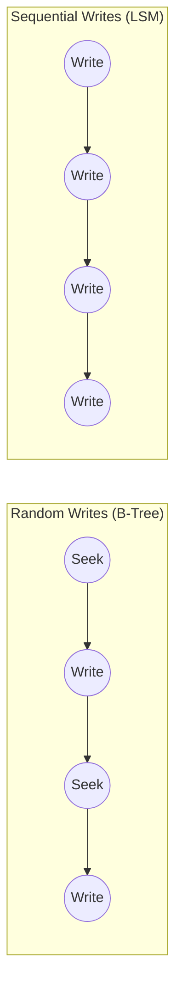
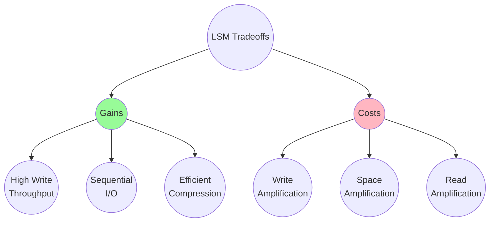
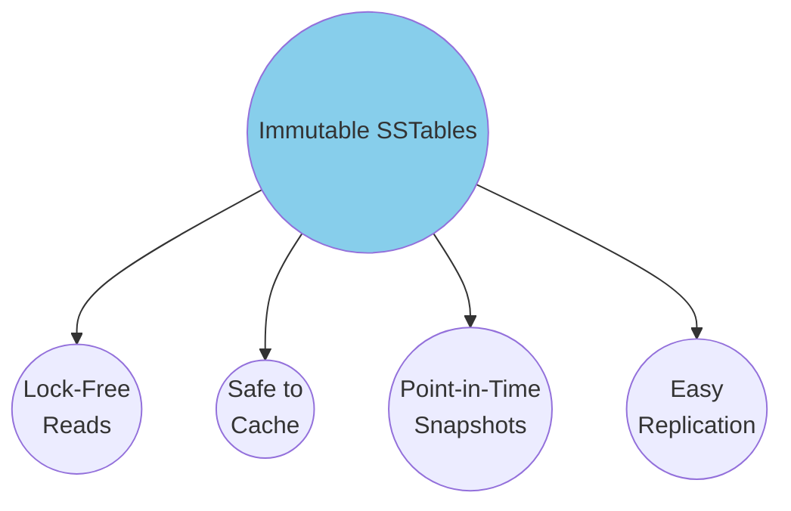
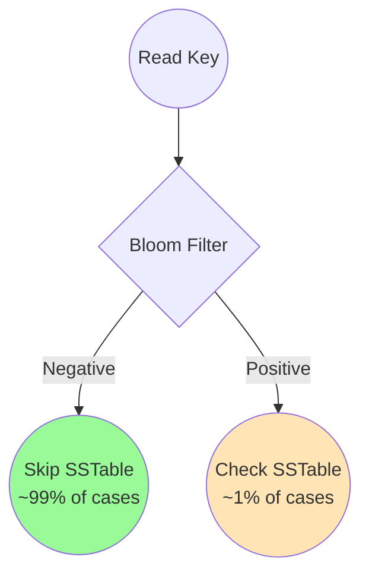
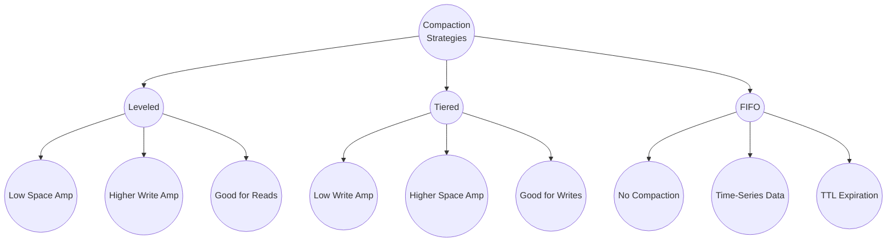
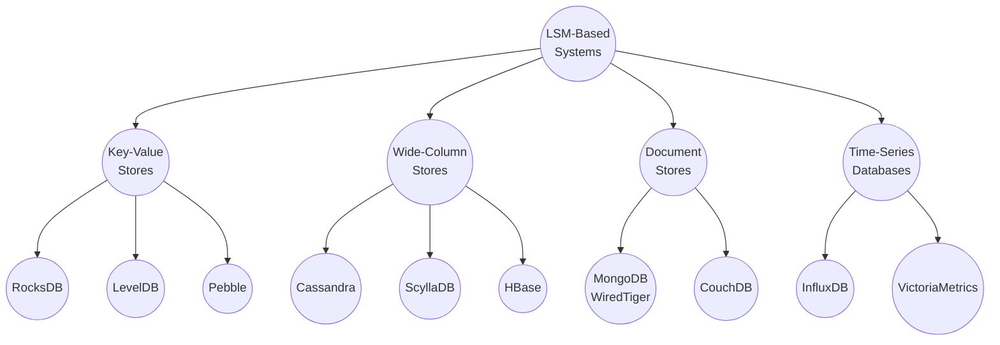
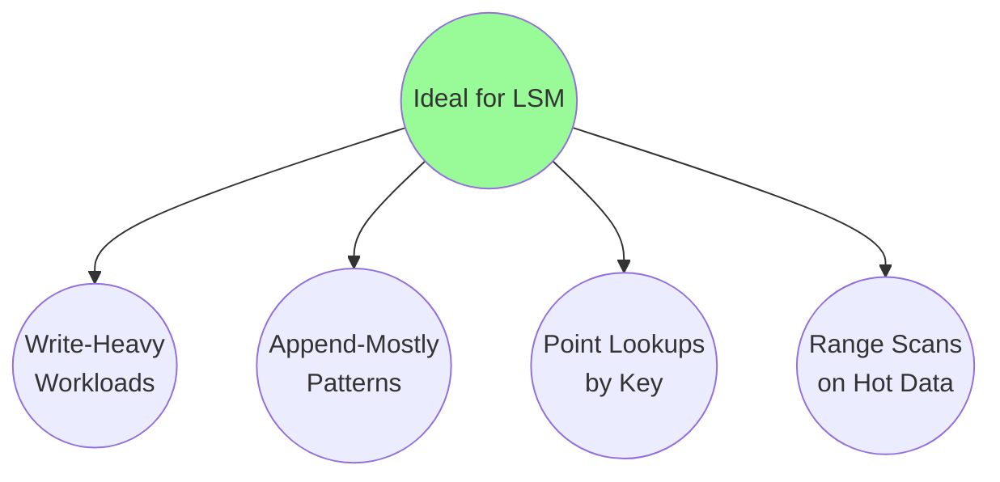
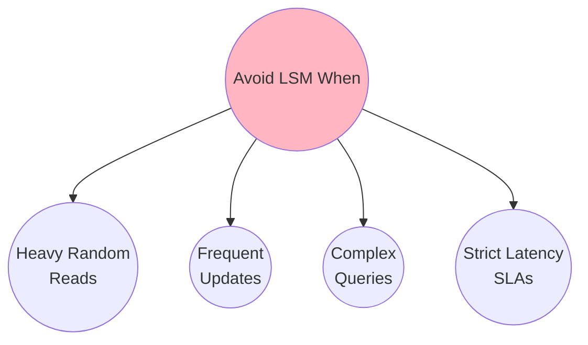
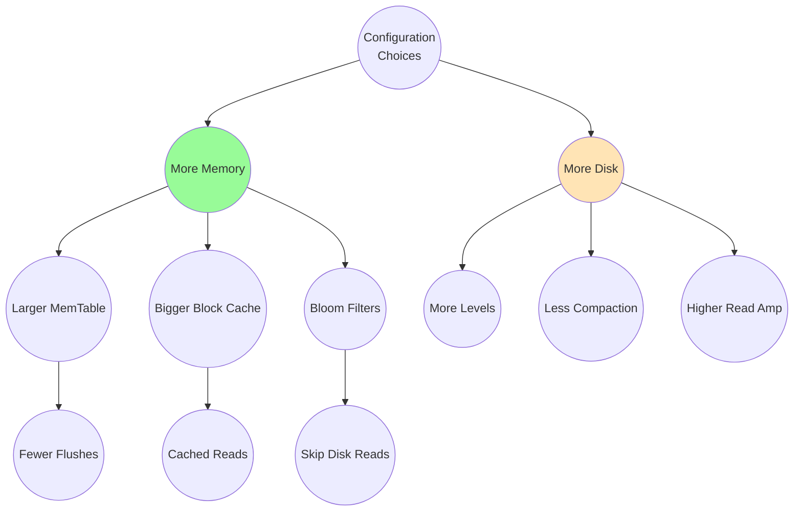

# Key Insights & Applications

Understanding why LSM trees work and where they excel helps you make informed architectural decisions.

## Core Insights

### 1. Sequential Writes Beat Random Writes

The fundamental insight behind LSM trees: **sequential I/O is dramatically faster than random I/O**.

| Storage Type | Random Write | Sequential Write | Ratio |
|--------------|--------------|------------------|-------|
| HDD | ~100 IOPS | ~100 MB/s | 1000x |
| SSD | ~10K IOPS | ~500 MB/s | 50x |
| NVMe | ~100K IOPS | ~3 GB/s | 30x |

Even on fast NVMe drives, sequential writes provide significant advantages.

### 2. Trade Write Amplification for Write Throughput

LSM trees accept **write amplification** (data written multiple times during compaction) in exchange for high write throughput:

**Write Amplification**: Data may be written 10-30x over its lifetime as it moves through levels.

**Space Amplification**: Temporary duplicate keys exist until compaction removes them.

**Read Amplification**: Reads may check multiple levels before finding a key.

### 3. Immutability Enables Concurrency

SSTable immutability provides powerful guarantees:

- **No read locks needed** - readers never conflict with writers
- **Cache-friendly** - SSTable blocks never change after creation
- **Snapshots are cheap** - just retain old SSTables
- **Replication is simple** - ship immutable files to replicas

### 4. Bloom Filters Are Essential

Without bloom filters, reads would be prohibitively slow:

A bloom filter with 10 bits per key achieves ~1% false positive rate, eliminating most unnecessary disk reads.

### 5. Compaction Strategy Matters

Different workloads benefit from different compaction strategies:

## Real-World Applications

### Databases Using LSM Trees

### Use Case Fit

| Use Case | LSM Fit | Why |
|----------|---------|-----|
| **Write-heavy OLTP** | Excellent | High write throughput |
| **Time-series data** | Excellent | Append-mostly, sequential |
| **Event logging** | Excellent | Write-once, read-rarely |
| **Message queues** | Good | Sequential writes, FIFO reads |
| **Caching layer** | Good | Fast writes, TTL support |
| **Read-heavy OLTP** | Moderate | Read amplification overhead |
| **OLAP / Analytics** | Poor | Full scans across levels |
| **Small datasets** | Poor | Overhead not worth it |

## When to Choose LSM Trees

### Ideal Workloads

**Best when:**
- Write throughput is critical
- Data is written once, read occasionally
- Keys have good locality (range queries benefit)
- You can tolerate slightly higher read latency

### Avoid When

**Not ideal when:**
- Read latency must be consistently low
- Same keys are updated frequently (high write amp)
- You need complex secondary indexes
- Dataset fits in memory anyway

## Performance Characteristics

### Complexity Analysis

| Operation | Average | Worst Case |
|-----------|---------|------------|
| Write | O(1) | O(1) |
| Point Read | O(log N) | O(L * log N) |
| Range Scan | O(log N + K) | O(L * log N + K) |
| Delete | O(1) | O(1) |

Where:
- **N** = total number of keys
- **L** = number of levels
- **K** = number of keys in range

### Memory vs Disk Tradeoffs

## Key Takeaways

1. **LSM trees optimize for write throughput** by converting random writes to sequential
2. **Immutability is a feature** - enables lock-free reads, easy snapshots, simple replication
3. **Bloom filters are critical** - without them, read performance would be unacceptable
4. **Choose your compaction strategy** based on your read/write ratio
5. **LSM trees shine for write-heavy, append-mostly workloads** - not for everything
