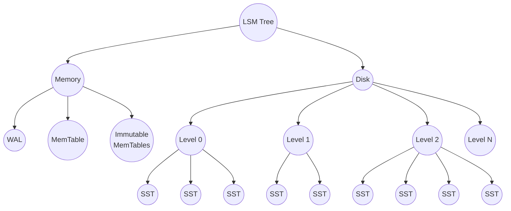
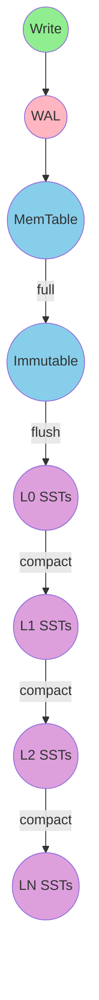
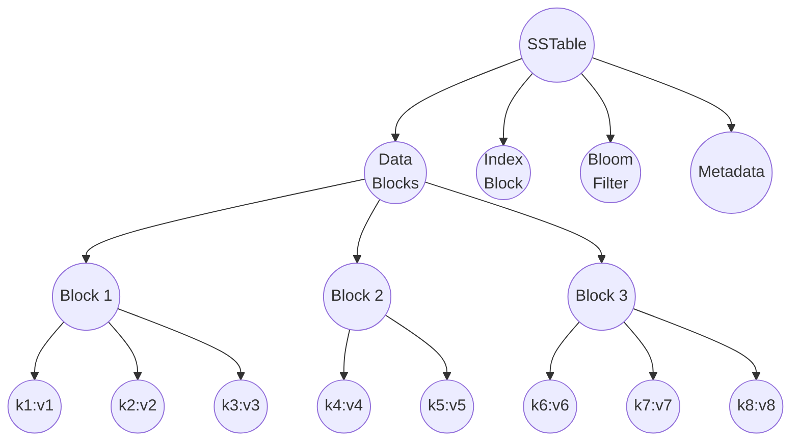
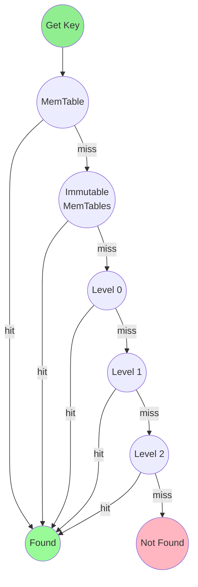
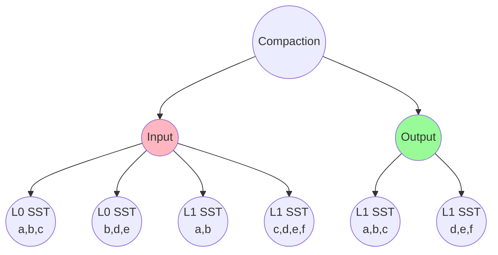
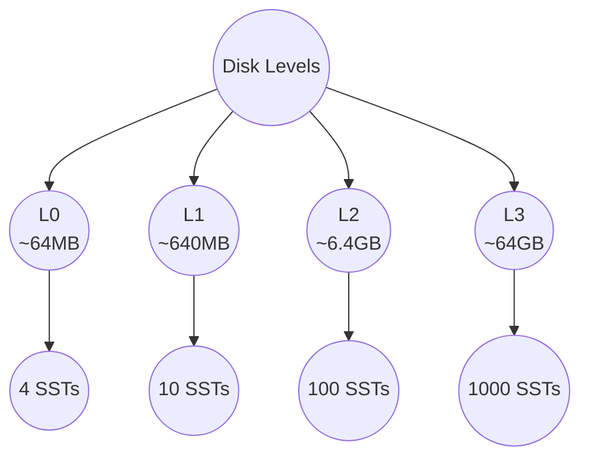

# LSM Tree Architecture

This diagram illustrates the structure and data flow of an LSM (Log-Structured Merge-tree) storage engine.

## LSM Tree Structure

The LSM tree organizes data hierarchically from fast memory to persistent disk storage:

## Data Flow Tree

Shows how data flows through the LSM tree from writes to compacted storage:

## SSTable Internal Structure

Each SSTable is organized as a tree of blocks:

## Read Path Tree

The search traverses the tree from newest to oldest data:

## Compaction Tree

Compaction merges overlapping SSTables into sorted, non-overlapping files:

## Level Size Tree

Each level grows exponentially larger (typically 10x):

## Key Concepts

| Component | Purpose |
|-----------|---------|
| **MemTable** | Fast in-memory writes using skip list |
| **WAL** | Durability - recover data after crash |
| **SSTable** | Immutable sorted file on disk |
| **Bloom Filter** | Skip SSTs that definitely don't contain a key |
| **Compaction** | Merge SSTables, remove duplicates and tombstones |
